# Beacon File Processor - Visual Architecture Diagrams

This document contains detailed visual diagrams using Mermaid syntax. You can view these diagrams by:
1. Opening this file in GitHub (renders Mermaid automatically)
2. Using a Mermaid preview extension in your IDE
3. Using online tools like https://mermaid.live/

---

## 1. System Overview - Component Diagram

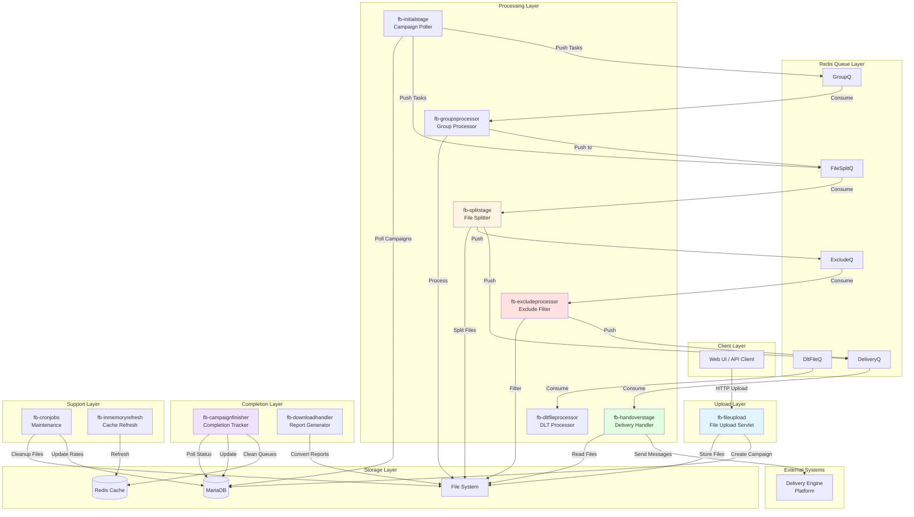

---

## 2. Campaign Processing - Sequence Diagram

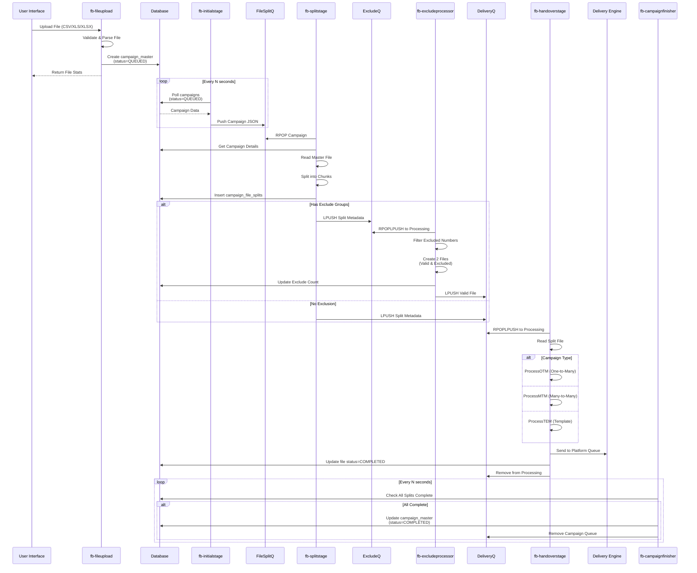

---

## 3. File Upload Flow - Detailed

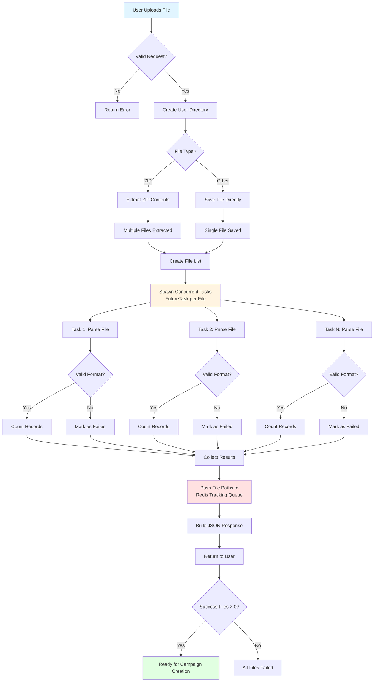

---

## 4. Redis Queue Architecture

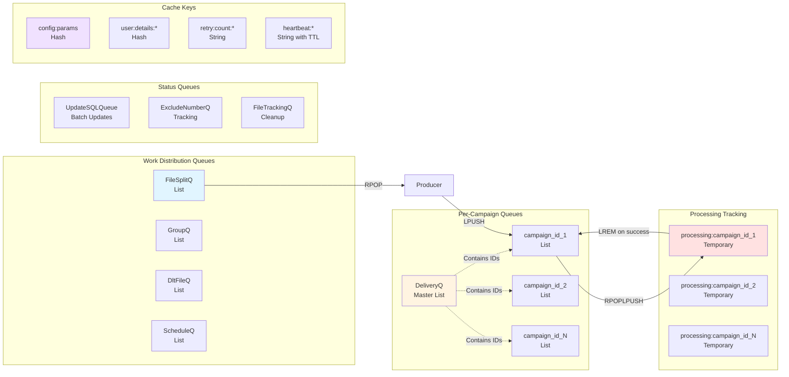

---

## 5. Module Dependency Diagram

```mermaid
graph TD
    subgraph "Shared Modules"
        UTILS[fb-utils<br/>Utilities, DTOs, Singletons]
        LOGGER[fb-logger<br/>Logging Framework]
        PARSER[fb-fileparser<br/>File Parsers]
        BEACON[beaconlib<br/>Platform Library]
    end
    
    subgraph "Service Modules"
        FU[fb-fileupload]
        IS[fb-initialstage]
        SS[fb-splitstage]
        EP[fb-excludeprocessor]
        HS[fb-handoverstage]
        GP[fb-groupsprocessor]
        DP[fb-dltfileprocessor]
        SP[fb-scheduleprocessor]
        CF[fb-campaignfinisher]
        DH[fb-downloadhandler]
        CJ[fb-cronjobs]
        IMR[fb-inmemoryrefresh]
    end
    
    FU --> UTILS
    FU --> LOGGER
    FU --> PARSER
    
    IS --> UTILS
    IS --> LOGGER
    IS --> BEACON
    
    SS --> UTILS
    SS --> LOGGER
    SS --> PARSER
    
    EP --> UTILS
    EP --> LOGGER
    EP --> PARSER
    
    HS --> UTILS
    HS --> LOGGER
    HS --> PARSER
    HS --> BEACON
    
    GP --> UTILS
    GP --> LOGGER
    GP --> PARSER
    
    DP --> UTILS
    DP --> LOGGER
    DP --> PARSER
    
    SP --> UTILS
    SP --> LOGGER
    
    CF --> UTILS
    CF --> LOGGER
    
    DH --> UTILS
    DH --> LOGGER
    
    CJ --> UTILS
    CJ --> LOGGER
    
    IMR --> UTILS
    IMR --> LOGGER
    
    style UTILS fill:#e1f5ff
    style LOGGER fill:#fff4e1
    style PARSER fill:#ffe1e1
```

---

## 6. Campaign State Machine

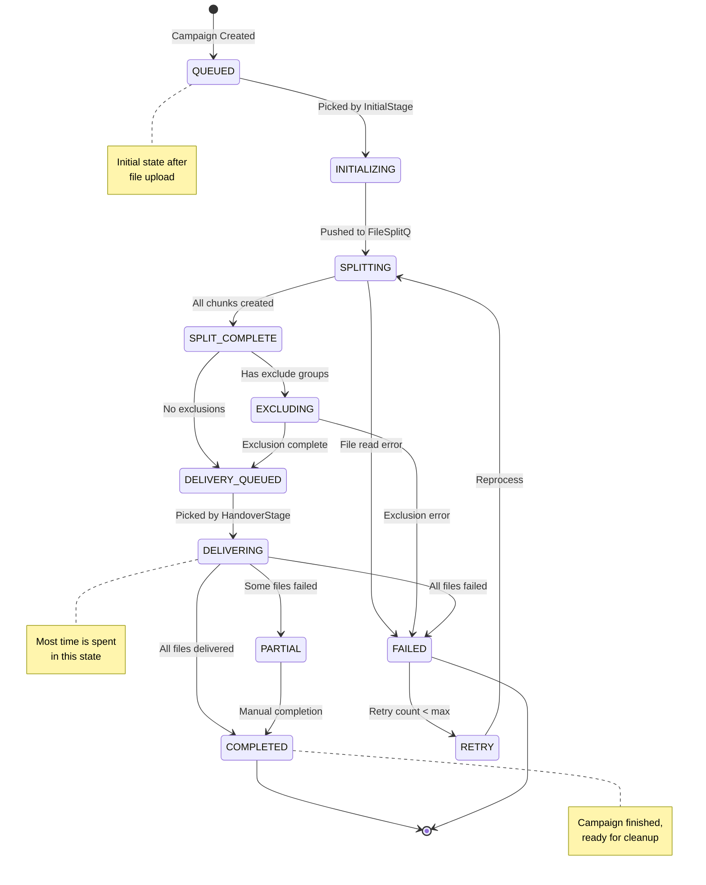

---

## 7. File Processing Pipeline

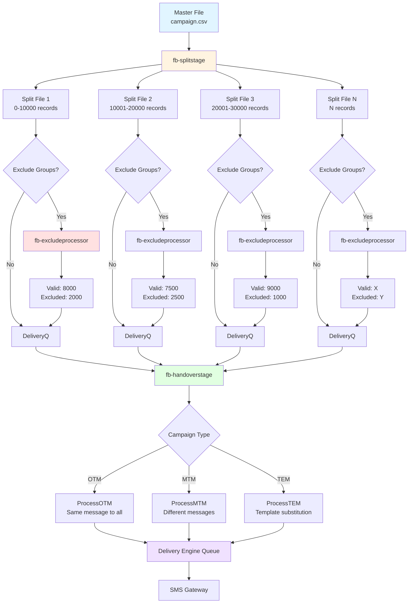

---

## 8. Group Processing Flow

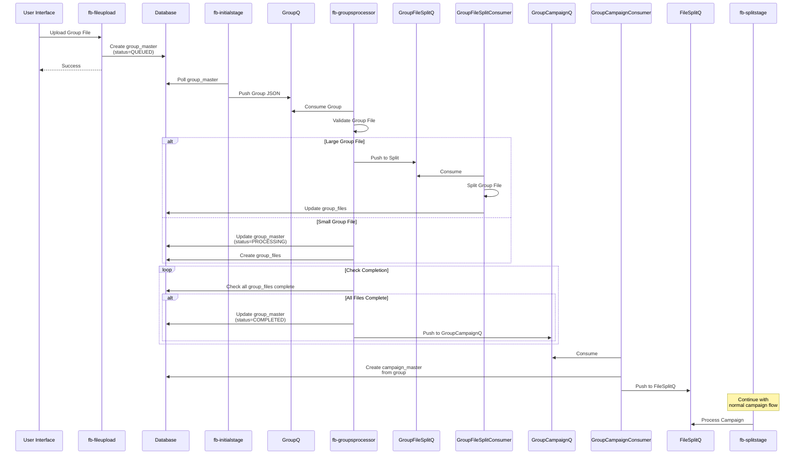

---

## 9. Exclude Processing - Detailed

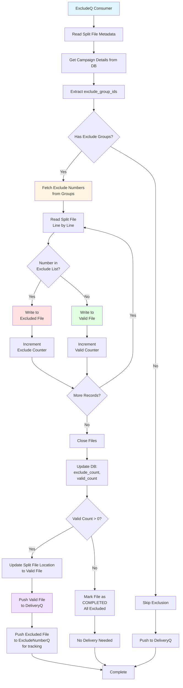

---

## 10. HandoverStage Processing Types

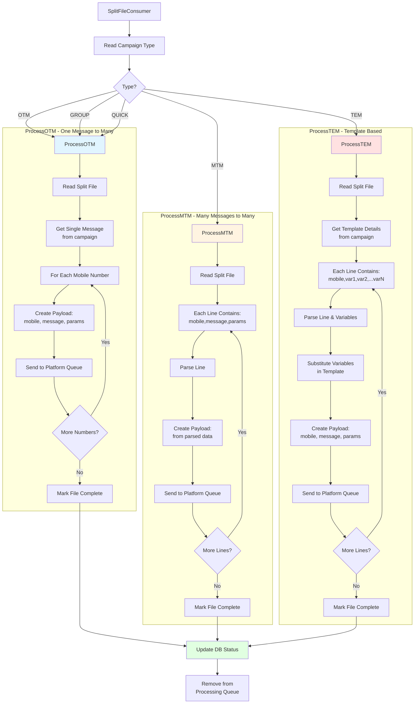

---

## 11. Error Handling & Retry Flow

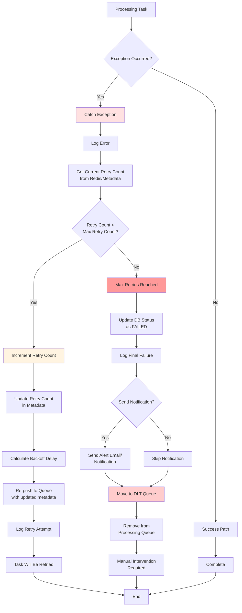

---

## 12. Campaign Completion Tracking

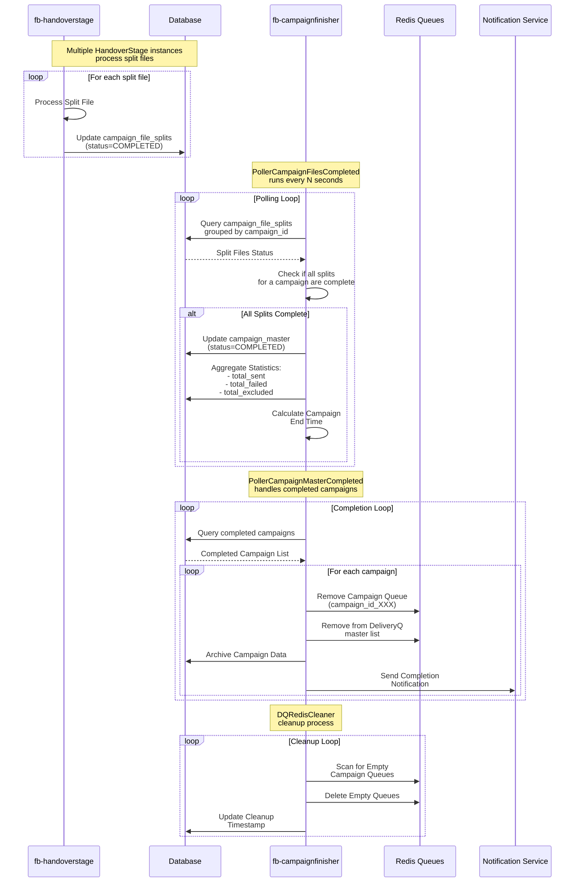

---

## 13. File Cleanup - CronJobs

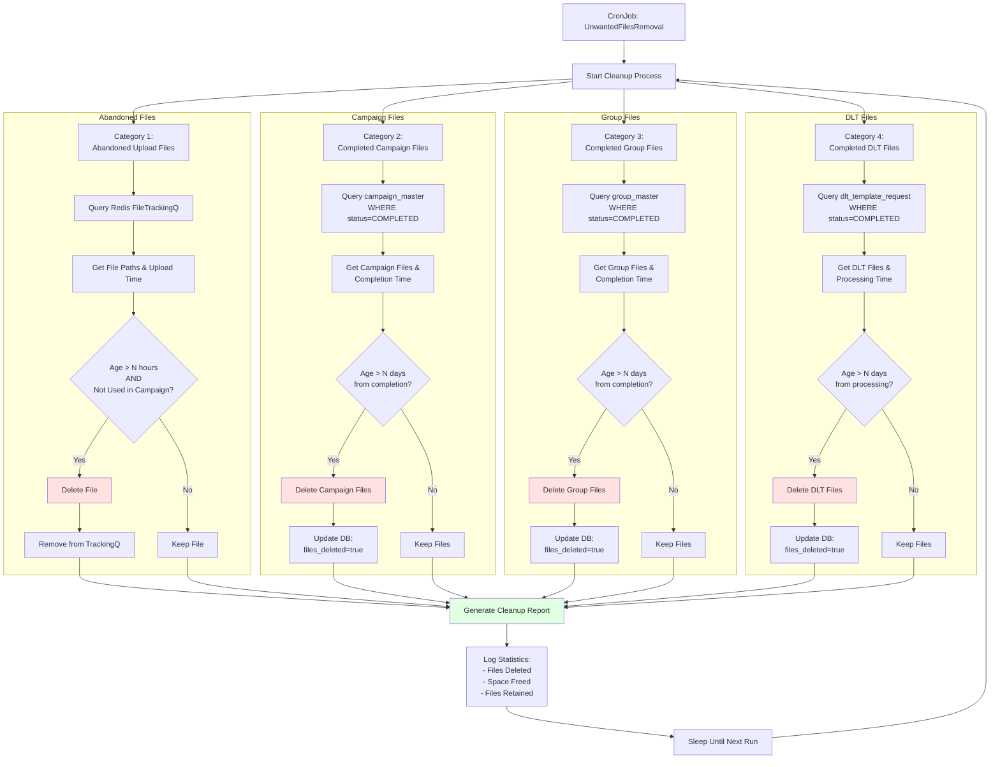

---

## 14. Monitoring & Heartbeat System

```mermaid
graph TB
    subgraph "Module Instances"
        M1[fb-splitstage Instance 1]
        M2[fb-splitstage Instance 2]
        M3[fb-handoverstage Instance 1]
        M4[fb-handoverstage Instance 2]
        M5[fb-excludeprocessor Instance 1]
        MN[... N More Instances]
    end
    
    subgraph "Heartbeat Collection"
        M1 -->|Every 30s| HB1[heartbeat:FP-SplitStage:FileSplitQConsumer:instance1:thread1]
        M2 -->|Every 30s| HB2[heartbeat:FP-SplitStage:FileSplitQConsumer:instance2:thread1]
        M3 -->|Every 30s| HB3[heartbeat:FP-HandoverStage:SplitFileConsumer:instance1:thread1]
        M4 -->|Every 30s| HB4[heartbeat:FP-HandoverStage:SplitFileConsumer:instance2:thread1]
        M5 -->|Every 30s| HB5[heartbeat:FP-ExcludeProcessor:ExcludeConsumer:instance1:thread1]
        MN -->|Every 30s| HBN[heartbeat:...]
    end
    
    subgraph "Redis Heartbeat Storage"
        HB1 --> R[Redis<br/>TTL: 120 seconds]
        HB2 --> R
        HB3 --> R
        HB4 --> R
        HB5 --> R
        HBN --> R
    end
    
    subgraph "Monitoring System"
        R --> MS[Heartbeat Monitor]
        MS --> C1{Check TTL}
        C1 -->|Key Exists| OK[Module Healthy]
        C1 -->|Key Missing| FAIL[Module Down]
        
        OK --> DASH[Monitoring Dashboard]
        FAIL --> ALERT[Alert System]
        
        ALERT --> EMAIL[Email Notification]
        ALERT --> SLACK[Slack Notification]
        ALERT --> SMS[SMS Alert]
    end
    
    subgraph "Prometheus Metrics"
        M1 --> P1[/metrics endpoint]
        M2 --> P2[/metrics endpoint]
        M3 --> P3[/metrics endpoint]
        
        P1 --> PROM[Prometheus Server]
        P2 --> PROM
        P3 --> PROM
        
        PROM --> GRAF[Grafana Dashboard]
    end
    
    DASH --> V[Ops Team View]
    GRAF --> V
    
    style FAIL fill:#ff9999
    style ALERT fill:#ffcccc
    style OK fill:#99ff99
    style DASH fill:#e1f5ff
```

---

## 15. Database Schema - Key Tables

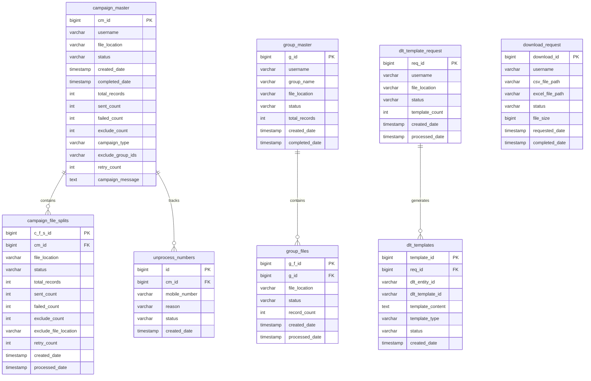

---

## 16. Configuration Management Flow

```mermaid
flowchart TD
    A[Configuration Sources] --> B1[properties/common/<br/>Global Properties]
    A --> B2[properties/fileprocessor/<br/>Module Properties]
    A --> B3[properties/profile/<br/>Environment Properties]
    
    B1 --> C[Property Files Loader]
    B2 --> C
    B3 --> C
    
    C --> D{Load Time}
    
    D -->|Application Startup| E1[ConfigParamsTon<br/>Singleton Init]
    D -->|Runtime| E2[Database config_params<br/>Table]
    
    E1 --> F[In-Memory Cache<br/>Properties Configuration]
    E2 --> F
    
    F --> G[Redis Cache<br/>config:params Hash]
    
    G --> H{Access Method}
    
    H -->|Module Needs Config| I[ConfigParamsTon<br/>.getInstance()<br/>.getConfigurationFromconfigParams]
    
    I --> J[Return Map<<br/>String, String>]
    
    J --> K[Module Uses Config]
    
    subgraph "Refresh Mechanism"
        L[fb-inmemoryrefresh<br/>HTTP Endpoint] --> M[/refresh API called]
        M --> N[Clear Cache]
        N --> O[Reload from DB]
        O --> P[Update Redis]
        P --> Q[Notify All Modules]
    end
    
    subgraph "Auto Refresh"
        R[Scheduled Job] --> S[Every N minutes]
        S --> N
    end
    
    L -.->|Triggers| N
    R -.->|Triggers| N
    
    Q --> F
    
    style F fill:#e1f5ff
    style G fill:#fff4e1
    style N fill:#ffe1e1
    style Q fill:#e1ffe1
```

---

## 17. Deployment Architecture

```mermaid
graph TB
    subgraph "Load Balancer Layer"
        LB[Nginx Load Balancer<br/>:80 / :443]
    end
    
    subgraph "Application Layer - Singleton Modules"
        FU1[fb-fileupload:8080]
        IS1[fb-initialstage:8081]
        CF1[fb-campaignfinisher:8087]
        DH1[fb-downloadhandler:8088]
        CJ1[fb-cronjobs:8089]
        IMR1[fb-inmemoryrefresh:8090]
    end
    
    subgraph "Application Layer - Scalable Modules"
        SS1[fb-splitstage:8082]
        SS2[fb-splitstage:8082]
        SS3[fb-splitstage:8082]
        
        EP1[fb-excludeprocessor:8083]
        EP2[fb-excludeprocessor:8083]
        
        HS1[fb-handoverstage:8084]
        HS2[fb-handoverstage:8084]
        HS3[fb-handoverstage:8084]
        HS4[fb-handoverstage:8084]
        HS5[fb-handoverstage:8084]
        
        GP1[fb-groupsprocessor:8085]
        GP2[fb-groupsprocessor:8085]
        
        DP1[fb-dltfileprocessor:8086]
    end
    
    subgraph "Data Layer"
        subgraph "Redis Cluster"
            R1[(Redis Master 1<br/>:6379)]
            R2[(Redis Replica 1<br/>:6380)]
            R3[(Redis Master 2<br/>:6381)]
            R4[(Redis Replica 2<br/>:6382)]
        end
        
        subgraph "Database Cluster"
            DB1[(MariaDB Master<br/>:3306)]
            DB2[(MariaDB Slave 1<br/>:3307)]
            DB3[(MariaDB Slave 2<br/>:3308)]
        end
    end
    
    subgraph "Storage Layer"
        NFS[NFS Shared Storage<br/>File Repository]
    end
    
    subgraph "Monitoring Layer"
        PROM[Prometheus<br/>:9090]
        GRAF[Grafana<br/>:3000]
        ES[Elasticsearch<br/>:9200]
        KB[Kibana<br/>:5601]
    end
    
    LB --> FU1
    LB --> IMR1
    
    FU1 --> R1
    IS1 --> R1
    SS1 --> R1
    SS2 --> R3
    SS3 --> R1
    EP1 --> R1
    EP2 --> R3
    HS1 --> R1
    HS2 --> R3
    HS3 --> R1
    HS4 --> R3
    HS5 --> R1
    GP1 --> R1
    GP2 --> R3
    DP1 --> R1
    CF1 --> R1
    DH1 --> R1
    
    R1 --> R2
    R3 --> R4
    
    FU1 --> DB1
    IS1 --> DB1
    SS1 --> DB1
    EP1 --> DB1
    HS1 --> DB1
    GP1 --> DB1
    DP1 --> DB1
    CF1 --> DB1
    
    DB1 --> DB2
    DB1 --> DB3
    
    FU1 --> NFS
    SS1 --> NFS
    SS2 --> NFS
    SS3 --> NFS
    EP1 --> NFS
    EP2 --> NFS
    HS1 --> NFS
    HS2 --> NFS
    HS3 --> NFS
    HS4 --> NFS
    HS5 --> NFS
    GP1 --> NFS
    GP2 --> NFS
    DP1 --> NFS
    DH1 --> NFS
    
    FU1 -.->|metrics| PROM
    SS1 -.->|metrics| PROM
    HS1 -.->|metrics| PROM
    
    PROM --> GRAF
    
    FU1 -.->|logs| ES
    SS1 -.->|logs| ES
    HS1 -.->|logs| ES
    
    ES --> KB
    
    style LB fill:#e1f5ff
    style R1 fill:#fff4e1
    style DB1 fill:#ffe1e1
    style NFS fill:#e1ffe1
    style PROM fill:#f0e1ff
```

---

These diagrams provide a comprehensive visual representation of the Beacon File Processor system architecture, data flows, and operational workflows. You can copy these Mermaid diagrams into any Mermaid-compatible viewer to see them rendered as visual diagrams.
